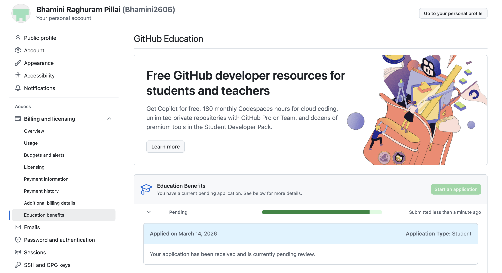

# Introduction

## Assignment Overview

**Prompt:**
Download and install Positron and become familiar with the interface by following the activities in the videos.

**Response:**
In this workshop, I explored Positron, a modern development environment designed for data science workflows. Positron provides an interface similar to RStudio but includes additional tools that improve productivity and integrate artificial intelligence features. By following the installation and tutorial videos, I learned how to create projects, work with Quarto documents, and navigate the Positron interface. This workshop helped me understand how Positron can be used to create reproducible reports and manage data science workflows efficiently.

---

# What I Like About Positron Compared With RStudio

**Prompt:**
Based on what you learned from Step 1 and Step 3, what do you like about Positron compared with RStudio?

**Response:**
After exploring Positron, I noticed several improvements compared with RStudio. One feature I appreciate is the modern interface and the flexible layout, which makes it easier to organize files and navigate between tools. Positron also integrates AI-powered features directly into the environment, which can assist with coding, debugging, and learning new functions. Another advantage is its strong integration with Quarto, allowing users to easily create professional reports with structured formatting, tables of contents, and interactive features. Overall, Positron feels more modern and adaptable for current data science workflows.

> **Reflection:**
> Positron provides a cleaner interface and integrates modern development tools that make working with data science projects more efficient.

---

# Using AI Inside Positron

**Prompt:**
Describe the various ways you can use AI inside Positron. Some are free while others are not.

**Response:**
Positron supports multiple AI tools that assist users while coding and writing reports. These tools can help generate code, explain programming concepts, suggest improvements, and assist with debugging errors. AI assistants can also help write documentation, summarize datasets, or provide suggestions for statistical analysis. Some AI tools are free, while others require subscriptions or accounts. For example, GitHub Copilot provides AI-powered code completion and suggestions, which can help users write code more quickly and learn programming techniques more efficiently.

---

# GitHub Copilot Experience

**Prompt:**
Which AI tools have you installed or set up? Which AI tools did you find beneficial for you?

**Response:**
I installed GitHub Copilot as an AI assistant for coding inside the development environment. GitHub Copilot uses machine learning to suggest code snippets and automatically complete lines of code while programming. This feature can save time and help users discover new functions or programming patterns.

::: {.callout-tip}
GitHub Copilot is especially helpful for beginners because it suggests possible code solutions and explanations while writing code.
:::
## GitHub Education Application
Below is the screenshot showing that I applied for the GitHub Student Developer Pack and GitHub Copilot.
